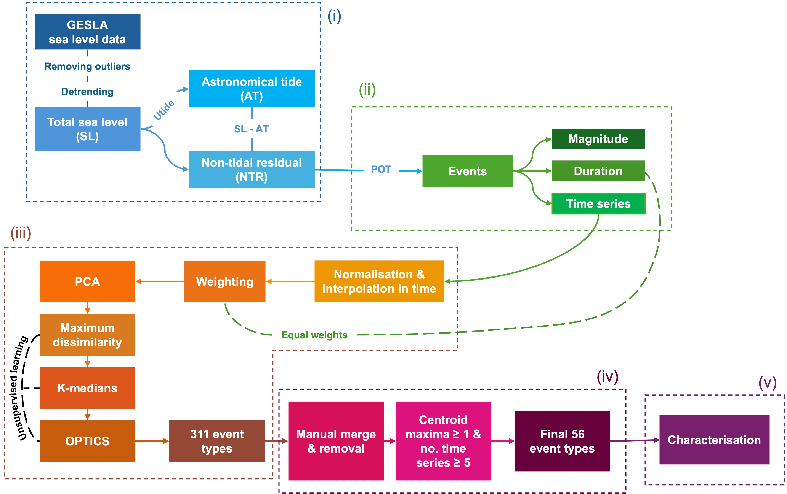

# Extremes-Timeseries-Class

Framework for extreme event type classification from
> Pupić Vurilj, M. et al. *Storm surge hydrographs from historical observations of sea level along the Dutch North Sea coast.* Nat Hazards (2025). [https://doi.org/10.1007/s11069-025-07351-8](https://doi.org/10.1007/s11069-025-07351-8)

<div align="center">
  
</div>

<br>
The framework consists of four notebooks:

#### 1. GESLA extract variables
&nbsp;&nbsp;&nbsp;&nbsp;&nbsp;&nbsp; Notebook to extract all necessary variables from the [GESLA-3 dataset](https://gesla787883612.wordpress.com/).

#### 2. Extremes
&nbsp;&nbsp;&nbsp;&nbsp;&nbsp;&nbsp; Notebook to extract extreme events using Peak Over Threshold (POT).

#### 3. Event types
&nbsp;&nbsp;&nbsp;&nbsp;&nbsp;&nbsp; Notebook to normalise storm surge hydrographs and perform clustering.

#### 4. Characterisation
&nbsp;&nbsp;&nbsp;&nbsp;&nbsp;&nbsp; Notebook to characterise event types.

## Installation

For dependencies, install the [BlueMath {Toolkit}](https://github.com/GeoOcean/BlueMath_tk):

```
pip install bluemath-tk
```
or
```
conda install conda-forge::bluemath-tk
```

> [!IMPORTANT]
> The notebook 01_GESLA_extract_variables.ipynb requires the [Utide package](https://github.com/wesleybowman/UTide). UTide depends on a specific version of SciPy to function properly.

```
  pip uninstall scipy
  pip install scipy==1.11.4 
  pip install utide
```

## Authors

- [@pupicvuriljm](https://github.com/pupicvuriljm)

<br>

> [!NOTE]
> The framework is also available as part of the open-source Python repository [BlueMath](https://github.com/GeoOcean/BlueMath)


